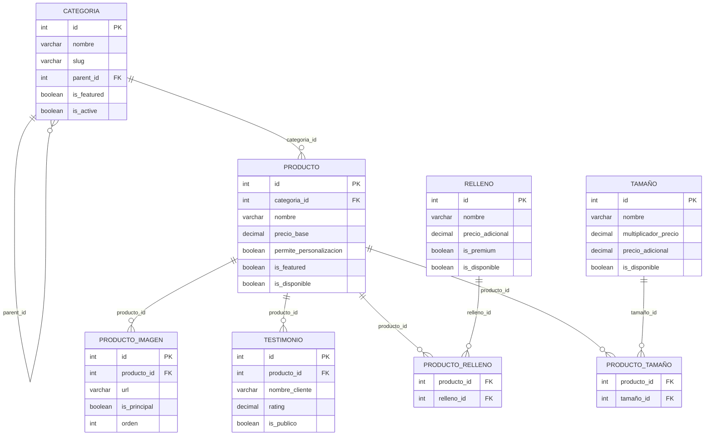

# 🗄️ **ESQUEMA DE BASE DE DATOS - KOKORITO**

Documentación completa de la estructura de la base de datos **`atusalud_kokorito`** con **8 tablas** y sus relaciones.

---

## 🎯 **RESUMEN EJECUTIVO**

La base de datos está diseñada con un **patrón relacional normalizado** que permite:
- ✅ **Flexibilidad** en productos (múltiples tamaños y rellenos)
- ✅ **Escalabilidad** para nuevos productos y categorías  
- ✅ **Integridad referencial** entre todas las entidades
- ✅ **Optimización** para consultas frecuentes

---

## 📋 **TABLAS PRINCIPALES**

### 🏷️ **1. CATEGORIA** (5 registros, 14 columnas)
**Propósito:** Organización jerárquica de productos

| Campo | Tipo | Descripción | Relación |
|-------|------|-------------|----------|
| `id` | INT PK | Identificador único | ➡️ `producto.categoria_id` |
| `nombre` | VARCHAR | Nombre de la categoría | |
| `slug` | VARCHAR | URL amigable | |
| `parent_id` | INT FK | Categoría padre (jerarquía) | ↩️ `categoria.id` |
| `is_featured` | BOOLEAN | Categoría destacada | |
| `is_active` | BOOLEAN | Estado activo/inactivo | |

**Características especiales:**
- 🔄 **Auto-relación** (`parent_id`) para subcategorías
- 🎨 **Personalización visual** (`color_tema`, `imagen_url`)
- 📈 **SEO optimizado** (`meta_title`, `meta_description`)

---

### 🛍️ **2. PRODUCTO** (6 registros, 27 columnas)
**Propósito:** Catálogo principal de productos

| Campo | Tipo | Descripción | Relación |
|-------|------|-------------|----------|
| `id` | INT PK | Identificador único | ⬅️ Múltiples tablas |
| `categoria_id` | INT FK | Categoría del producto | ➡️ `categoria.id` |
| `nombre` | VARCHAR | Nombre del producto | |
| `precio_base` | DECIMAL | Precio base antes de modificadores | |
| `stock_disponible` | INT | Cantidad en inventario | |
| `permite_personalizacion` | BOOLEAN | Si acepta rellenos/tamaños | |

**Características especiales:**
- 💰 **Sistema de precios** (base + ofertas)
- 📊 **Métricas integradas** (`rating_promedio`, `total_ventas`)
- ⏱️ **Gestión de tiempo** (`tiempo_preparacion_hrs`)
- 🎯 **Marketing** (`is_featured`, `is_disponible`)

---

## 🔗 **TABLAS DE RELACIÓN (Many-to-Many)**

### 🧁 **3. PRODUCTO_RELLENO** (20 registros, 2 columnas)
**Propósito:** Conexión flexible entre productos y rellenos

```sql
CREATE TABLE producto_relleno (
    producto_id INT,
    relleno_id INT,
    PRIMARY KEY (producto_id, relleno_id),
    FOREIGN KEY (producto_id) REFERENCES producto(id),
    FOREIGN KEY (relleno_id) REFERENCES relleno(id)
);
```

### 📏 **4. PRODUCTO_TAMAÑO** (14 registros, 2 columnas)  
**Propósito:** Conexión flexible entre productos y tamaños

```sql
CREATE TABLE producto_tamaño (
    producto_id INT,
    tamaño_id INT,
    PRIMARY KEY (producto_id, tamaño_id),
    FOREIGN KEY (producto_id) REFERENCES producto(id),
    FOREIGN KEY (tamaño_id) REFERENCES tamaño(id)
);
```

---

## 🎨 **TABLAS DE OPCIONES**

### 🍰 **5. RELLENO** (5 registros, 19 columnas)
**Propósito:** Sabores y rellenos disponibles

| Campo | Tipo | Descripción | Uso en Precio |
|-------|------|-------------|---------------|
| `id` | INT PK | Identificador único | |
| `nombre` | VARCHAR | Nombre del relleno | |
| `precio_adicional` | DECIMAL | Costo extra | ➕ `producto.precio_base` |
| `is_premium` | BOOLEAN | Relleno premium | 💎 Destacado en UI |
| `contiene_lactosa` | BOOLEAN | Info nutricional | 🥛 Alertas |
| `es_vegano` | BOOLEAN | Opción vegana | 🌱 Filtros |

### 📐 **6. TAMAÑO** (5 registros, 16 columnas)
**Propósito:** Tamaños disponibles para productos

| Campo | Tipo | Descripción | Uso en Precio |
|-------|------|-------------|---------------|
| `id` | INT PK | Identificador único | |
| `nombre` | VARCHAR | Nombre del tamaño | |
| `multiplicador_precio` | DECIMAL | Factor de multiplicación | ✖️ `producto.precio_base` |
| `precio_adicional` | DECIMAL | Costo fijo adicional | ➕ Después del multiplicador |
| `porciones_aproximadas` | INT | Número de porciones | 👥 Info para cliente |
| `diametro_cm` | INT | Tamaño físico | 📏 Especificaciones |

---

## 🖼️ **TABLAS DE CONTENIDO**

### 📸 **7. PRODUCTO_IMAGEN** (0 registros, 14 columnas)
**Propósito:** Galería de imágenes por producto

| Campo | Tipo | Descripción | Relación |
|-------|------|-------------|----------|
| `id` | INT PK | Identificador único | |
| `producto_id` | INT FK | Producto asociado | ➡️ `producto.id` |
| `url` | VARCHAR | URL de la imagen | |
| `is_principal` | BOOLEAN | Imagen principal | 🌟 Hero image |
| `orden` | INT | Orden en galería | 📑 Secuencia |

### 💬 **8. TESTIMONIO** (5 registros, 20 columnas)
**Propósito:** Reseñas y testimonios de clientes

| Campo | Tipo | Descripción | Relación |
|-------|------|-------------|----------|
| `id` | INT PK | Identificador único | |
| `producto_id` | INT FK | Producto reseñado | ➡️ `producto.id` |
| `rating` | DECIMAL | Calificación (1-5) | ⭐ Estrellas |
| `is_publico` | BOOLEAN | Visible públicamente | 👁️ Moderación |
| `is_verificado` | BOOLEAN | Compra verificada | ✅ Confiabilidad |

---

## 🔄 **DIAGRAMA DE RELACIONES**



---

## 💰 **SISTEMA DE PRECIOS**

### 🧮 **Cálculo de Precio Final**

```javascript
// Fórmula de precio completo
precio_final = (producto.precio_base * tamaño.multiplicador_precio) 
               + tamaño.precio_adicional 
               + relleno.precio_adicional

// Ejemplo práctico:
// Producto: Torta Chocolate (precio_base: $25.000)
// Tamaño: Grande (multiplicador: 1.5, adicional: $5.000)  
// Relleno: Frambuesa Premium (adicional: $3.000)
// 
// Cálculo: ($25.000 * 1.5) + $5.000 + $3.000 = $45.500
```

---

## 🔍 **CONSULTAS CLAVE**

### 📋 **1. Obtener producto completo con opciones**
```sql
-- Producto con todas sus opciones disponibles
SELECT 
    p.*,
    c.nombre as categoria_nombre,
    GROUP_CONCAT(DISTINCT r.nombre) as rellenos_disponibles,
    GROUP_CONCAT(DISTINCT t.nombre) as tamaños_disponibles
FROM producto p
LEFT JOIN categoria c ON p.categoria_id = c.id
LEFT JOIN producto_relleno pr ON p.id = pr.producto_id
LEFT JOIN relleno r ON pr.relleno_id = r.id AND r.is_disponible = 1
LEFT JOIN producto_tamaño pt ON p.id = pt.producto_id  
LEFT JOIN tamaño t ON pt.tamaño_id = t.id AND t.is_disponible = 1
WHERE p.id = ? AND p.is_active = 1
GROUP BY p.id;
```

### 🛒 **2. Productos por categoría con opciones**
```sql
-- Productos de una categoría con conteo de opciones
SELECT 
    p.*,
    COUNT(DISTINCT pr.relleno_id) as total_rellenos,
    COUNT(DISTINCT pt.tamaño_id) as total_tamaños,
    AVG(t.rating) as rating_promedio
FROM producto p
LEFT JOIN producto_relleno pr ON p.id = pr.producto_id
LEFT JOIN producto_tamaño pt ON p.id = pt.producto_id
LEFT JOIN testimonio t ON p.id = t.producto_id AND t.is_publico = 1
WHERE p.categoria_id = ? AND p.is_disponible = 1
GROUP BY p.id
ORDER BY p.is_featured DESC, p.total_ventas DESC;
```

### 💎 **3. Rellenos premium disponibles**
```sql
-- Rellenos premium ordenados por precio
SELECT * FROM relleno 
WHERE is_premium = 1 AND is_disponible = 1 AND is_active = 1
ORDER BY precio_adicional DESC;
```

---

## ⚡ **OPTIMIZACIONES**

### 📊 **Índices Recomendados**
```sql
-- Índices para consultas frecuentes
CREATE INDEX idx_producto_categoria ON producto(categoria_id, is_disponible, is_active);
CREATE INDEX idx_producto_featured ON producto(is_featured, total_ventas);
CREATE INDEX idx_relleno_disponible ON relleno(is_disponible, is_premium);
CREATE INDEX idx_tamaño_disponible ON tamaño(is_disponible, orden_display);
CREATE INDEX idx_testimonio_publico ON testimonio(producto_id, is_publico, rating);
```

### 🔄 **Triggers Sugeridos**
```sql
-- Actualizar rating promedio automáticamente
DELIMITER $$
CREATE TRIGGER update_producto_rating 
AFTER INSERT ON testimonio
FOR EACH ROW
BEGIN
    UPDATE producto 
    SET rating_promedio = (
        SELECT AVG(rating) 
        FROM testimonio 
        WHERE producto_id = NEW.producto_id AND is_publico = 1
    )
    WHERE id = NEW.producto_id;
END$$
DELIMITER ;
```

---

## 🚀 **ENDPOINTS RELACIONALES**

### 🔗 **Consultas de Relación Directa**
| Endpoint | Descripción | Relación |
|----------|-------------|----------|
| `/productos/{id}/rellenos` | Rellenos de un producto | `producto_relleno` |
| `/productos/{id}/tamaños` | Tamaños de un producto | `producto_tamaño` |
| `/productos/{id}/imagenes` | Imágenes de un producto | `producto_imagen` |
| `/productos/{id}/testimonios` | Testimonios de un producto | `testimonio` |
| `/categorias/{id}/productos` | Productos de una categoría | `producto.categoria_id` |

### 📈 **Consultas Agregadas**
| Endpoint | Descripción | Funcionalidad |
|----------|-------------|---------------|
| `/productos/destacados/list` | Productos featured | `is_featured = 1` |
| `/rellenos/disponibles/list` | Rellenos activos | `is_disponible = 1` |
| `/testimonios/publicos/list` | Reviews públicos | `is_publico = 1` |

---

## 📝 **REGLAS DE NEGOCIO**

### ✅ **Validaciones Implementadas**
1. **Productos:** Solo se muestran si `is_disponible = 1` AND `is_active = 1`
2. **Rellenos:** Solo disponibles si `is_disponible = 1` AND están relacionados al producto
3. **Tamaños:** Solo disponibles si `is_disponible = 1` AND están relacionados al producto
4. **Testimonios:** Solo públicos si `is_publico = 1` AND `is_active = 1`
5. **Categorías:** Jerarquía con `parent_id` para subcategorías

### 🎯 **Lógica de Personalización**
- Un producto solo acepta rellenos/tamaños si `permite_personalizacion = 1`
- Los precios se calculan dinámicamente según las selecciones
- Los rellenos premium se destacan visualmente
- Las imágenes se ordenan por `is_principal` y luego por `orden`

---

## 🔐 **SEGURIDAD Y INTEGRIDAD**

### 🛡️ **Constraints Implementadas**
```sql
-- Integridad referencial
FOREIGN KEY (categoria_id) REFERENCES categoria(id) ON DELETE RESTRICT;
FOREIGN KEY (producto_id) REFERENCES producto(id) ON DELETE CASCADE;

-- Validaciones de datos
CHECK (precio_base >= 0);
CHECK (precio_adicional >= 0);
CHECK (rating >= 1 AND rating <= 5);
CHECK (stock_disponible >= 0);
```

### 🔄 **Soft Delete**
Todas las tablas principales usan **eliminación suave** con `is_active = 0` para mantener integridad histórica.

---

## 📊 **ESTADÍSTICAS ACTUALES**

| Tabla | Registros | Estado | Capacidad |
|-------|-----------|--------|-----------|
| **categoria** | 5 | ✅ Poblada | Escalable |
| **producto** | 6 | ✅ Poblada | Escalable |
| **relleno** | 5 | ✅ Poblada | Escalable |
| **tamaño** | 5 | ✅ Poblada | Escalable |
| **testimonio** | 5 | ✅ Poblada | Escalable |
| **producto_imagen** | 0 | ⚠️ Vacía | Pendiente |
| **producto_relleno** | 20 | ✅ Poblada | Relacional |
| **producto_tamaño** | 14 | ✅ Poblada | Relacional |

---

## 🚀 **PRÓXIMOS PASOS**

1. ✅ **Completar imágenes** - Poblar `producto_imagen`
2. 📊 **Agregar métricas** - Triggers para estadísticas automáticas  
3. 🔍 **Optimizar consultas** - Índices adicionales según uso
4. 🎨 **Personalización avanzada** - Combinaciones de rellenos
5. 📱 **API GraphQL** - Para consultas complejas relacionales

---

*Documentación generada para Kokorito Web - Sistema de gestión de productos de repostería* 